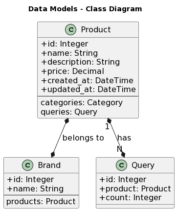

# Description of the task
We need to build a basic catalog system to manage products. A product should have basic info such as sku, name, price and brand.

In this system, we need to have at least two type of users: (i) admins to create / update / delete products and to create / update / delete other admins; and (ii) anonymous users who can only retrieve products information but can't make changes.

As a special requirement, whenever an admin user makes a change in a product (for example, if a price is adjusted), we need to notify all other admins about the change, either via email or other mechanism.

We also need to keep track of the number of times every single product is queried by an anonymous user, so we can build some reports in the future.

Your task is to build this system implementing a REST or GraphQL API using the stack of your preference.

# Design Decisions


<!-- TABLE OF CONTENTS -->
<details open="open">
  <summary>Table of Contents</summary>
  <ol>
    <li>
      <a href="#data-models">Data Models</a>
      <ul>
        <li><a href="#product">Product</a></li>
        <li><a href="#brand">Brand</a></li>
        <li><a href="#query">Query</a></li>
      </ul>
    </li>
    <li><a href="#data-relationships">Data Relationships</a></li>
    <li><a href="#endpoints">Endpoints</a></li>
    <li><a href="#authentication-and-authorization">Authentication and Authorization</a></li>
    <li><a href="#roadmap-for-development-process">Roadmap for Development Process</a></li>
  </ol>
</details>

Key features that need to be implemented based on the task description:

- Product Management: Implement CRUD (Create, Read, Update, Delete) operations for managing products. This includes storing basic product information such as SKU, name, price, and brand in a persistent data storage.

- User Roles: Implement two types of users - admins and anonymous users. Admins should have the ability to create/update/delete products and manage other admins. Anonymous users should only be able to retrieve product information but not make changes.

- Notifications: Implement a mechanism to notify all other admins when a change is made to a product. This can be done via email or any other suitable mechanism.

- Tracking Queries: Implement a system to track the number of times each product is queried by anonymous users. This data can be used for building future reports or analytics.


# Data Models

## Product

Represents a product in the catalog system with fields such as id, name, description, price, category, created_at, and updated_at. This model will have a many-to-many relationship with other models like Category (if applicable).

```python
class Product(models.Model):
    id = models.AutoField(primary_key=True)
    sku = models.CharField(max_length=50, unique=True)
    name = models.CharField(max_length=100)
    price = models.DecimalField(max_digits=10, decimal_places=2)
    brand = models.CharField(max_length=50)
    description = models.TextField()
    created_at = models.DateTimeField(auto_now_add=True)
    updated_at = models.DateTimeField(auto_now=True)
    categories = models.ManyToManyField(Category, related_name='products', blank=True)
```

## Brand

Represents a brand in the catalog system with fields such as id and name. This model will have a many-to-many relationship with the `Product` model.

```python
class Brand(models.Model):
    id = models.AutoField(primary_key=True)
    name = models.CharField(max_length=255)
```

## Query

Represents a query in the analytics system with fields such as id, product, and count.

```python
class Query(models.Model):
    id = models.AutoField(primary_key=True)
    product = models.ForeignKey(Product, on_delete=models.CASCADE, related_name='queries')
    count = models.IntegerField(default=0)
```

# Data Relationships

- `Product` model can have a many-to-many relationship with `Brands` model to represent product categories.
- `Product` model can have a one-to-many relationship with `Query` model to represent the number of times a product has been queried.


# Endpoints

## `/api/users/`

- `GET`: Retrieve a list of all users (for admins only).
- `POST`: Create a new users (for admins only).

## `/api/users/<product_id>/`

- `GET`: Retrieve details of a specific user (for admins only).
- `PUT/PATCH`: Update details of a specific user (for admins only).
- `DELETE`: Delete a specific user (for admins only).


## `/api/products/`

- `GET`: Retrieve a list of all products (for both admins and anonymous users).
- `POST`: Create a new product (for admins only).

## `/api/products/<product_id>/`

- `GET`: Retrieve details of a specific product (for both admins and anonymous users).
- `PUT/PATCH`: Update details of a specific product (for admins only).
- `DELETE`: Delete a specific product (for admins only).

## `/api/brands/`

- `GET`: Retrieve a list of all brands ((for admins only)).
- `POST`: Create a new brands (for admins only).

## `/api/brands/<brand_id>/`

- `GET`: Retrieve details of a specific brand ((for admins only)).
- `PUT/PATCH`: Update details of a specific brand (for admins only).
- `DELETE`: Delete a specific brand (for admins only).


## `/auth/login/`
- `POST`: Authenticate a user and log them in. Accepts username and password fields in the request body.

## `/auth/logout/`
- `POST`: Log out the currently authenticated user.

## `/api/docs/`
- `GET`: Swagger auto generated API documentation.

# Authentication and Authorization

- Authentication: Django's built-in Authentication system
- Authorization: Django's built-in authorization system

# Roadmap for Development Process:
- Set up a virtual environment for the project and installing the necessary dependencies, including Django and Django REST framework.
- Define the models for products, admins, and other necessary entities, and create database tables using Django's built-in ORM.
- Implement the CRUD operations for product management, including creating, reading, updating, and deleting products, using Django REST framework's views and serializers.
- Implement the user roles for admins and anonymous users using Django's authentication and authorization system.
- Implement the tracking of product queries by anonymous users, such as using Django's logging or custom analytics solutions.
- Write unit tests for the implemented functionalities to ensure code quality and functionality.
- Implement the notification mechanism for admins when changes are made to products, such as sending emails or using other suitable mechanisms.
- Containerize the application using Docker for easy deployment and scalability.
- Generate API documentation using Django REST framework's built-in documentation tools or other suitable options.
- Create clear and concise documentation on how to set up the environment, run the app, and use the API endpoints.
- Deploy the application to a real environment, such as a cloud server or a platform-as-a-service (PaaS) provider.
